<!-- Images in assets/ and the language block below are generated: node scripts/build.mjs -->

  

  <b>Веб-разработчик.</b> Делаю сайты на WordPress и интерфейсы на React и Next.js — от вёрстки до бэкенда.

 

<code>01</code>&nbsp; <b>Стек</b>

  
  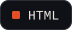
  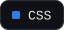
  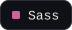
  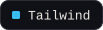
  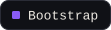
  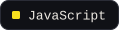
  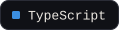
  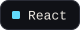
  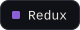
  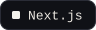
   
  
  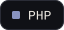
  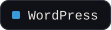
  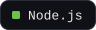
  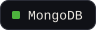
   
  
  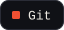
  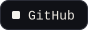

 

<code>02</code>&nbsp; <b>Языки в репозиториях</b>

<!-- langs:start -->
 
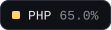
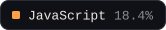
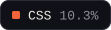
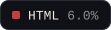
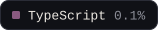
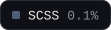
<!-- langs:end -->

 

<code>03</code>&nbsp; <b>Связаться со мной</b>

  
  <a href="https://t.me/AleksandrDRq">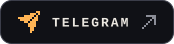</a>

 

  
  &nbsp;
  
  &nbsp;
  Факел горит с 2023 года

